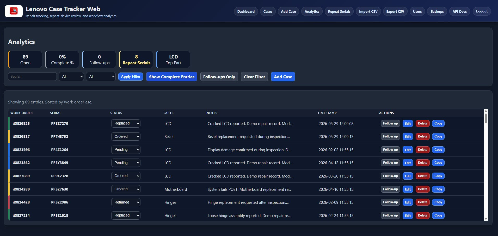

# 🖥️ Lenovo Case Tracker Web

A FastAPI-based web application built for tracking Lenovo repair cases, repeat hardware issues, repair statuses, follow-ups, and workflow analytics in real-world K-12 IT environments.

This project started as a desktop Python utility used for managing daily repair workflows and eventually evolved into a database-backed web application with authentication, analytics, and multi-user support.

---

## 📸 Screenshot

---

## 🚀 Live Demo

👉 https://lenovo-case-tracker-web.onrender.com/

---

Demo Access

Use the Continue as Demo User button on the login page to explore the application immediately.

The demo environment contains fictional repair records generated for portfolio and demonstration purposes.

Demo users can:

Browse repair cases
Explore analytics dashboards
Review repeat serial number detection
View workflow history

Administrative and destructive actions are restricted.

---

## ✨ Features

### 📋 Case Tracking
- Work Orders
- Serial Numbers
- Repair Status Tracking
- Parts Tracking
- Notes & Follow-ups

### 🔍 Workflow Features
- Repeat serial number detection
- Oldest open case tracking
- Status history tracking
- Persistent sorting and filtering
- Lenovo case text parsing
- Quick copy case summaries

### 📊 Analytics
- Dashboard statistics
- Workflow analytics
- Repair status breakdowns
- Follow-up tracking

### 🔐 Security & User Management
- Google OAuth authentication
- Role-based access control
- Admin user management
- Secure session handling
- Database backups

### 💾 Data Management
- SQLite database backend
- CSV import/export support
- Multi-user support
- Responsive web UI

---

## 🛠️ Built With

- Python
- FastAPI
- SQLite
- Jinja2
- HTML/CSS
- JavaScript
- Google OAuth
- Uvicorn
- Render

---

## 🧠 Project Background

This project was built around real-world repair workflows used in K-12 IT support environments.

The original desktop version was created to help manage Lenovo repair cases, repeat hardware failures, and workflow organization. Over time, the project evolved into a fully web-based application with authentication, analytics, and multi-user functionality.

The goal of the project was both practical workflow improvement and continued growth in:
- backend development
- deployment workflows
- authentication/security
- database design
- UI/UX refinement
- operational tooling

---

## ⚠️ Notes

This application is intended as a portfolio and workflow-management project. Sensitive production data, real credentials, and internal organizational information should never be uploaded or committed to the repository.

---

## 👤 Author

**Tyler Ledbetter**
